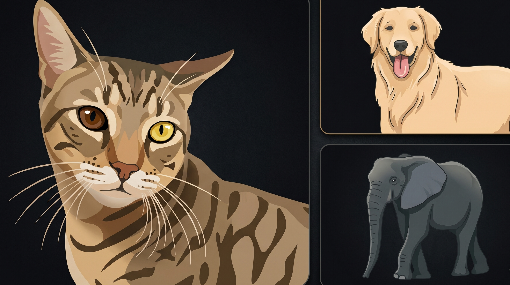
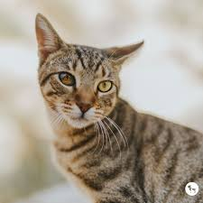
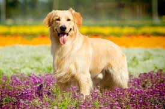
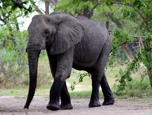

# Wildlife Image Classifier
An AI model that classifies wildlife species using transfer learning.

  

## Features
- Dataset Used - [Dataset](https://www.kaggle.com/datasets/antobenedetti/animals/data)
- MobileNetV2 transfer learning
- Wildlife image classification
- TensorFlow/Keras implementation

## Classes

### Cat

### Dog

### Elephant

## Accuracy
85% validation accuracy

## Tech Stack
- Python
- TensorFlow
- OpenCV

## Future Improvements
- Edge AI deployment
- More species
- Explainable AI
